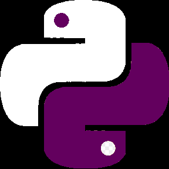

CodeZlang is an funny, basic programming language made in Python. It uses the GenZ Slang as its syntax, example:
"
lit a be hello rn
lit b be world rn
say <<a>>|<<b>>
"
or
lit a be hello|world rn
say <<a>> rn

**some info:**
CodeZlang doesn't support spaces in strings etc, so for example, "say hello world rn" won't work, however, "say hello|world rn" will.
Make sure EVERY LINE ends with an "rn" keyword.

**keywords:**
**lit** -- variable declaration, example: lit a be sup|yall rn \n
**say** -- printing function, example: say sup|yall rn
**rand** -- random number, example: rand do (variable name to store the result) 1 100
**do** -- do something, mostly used in functions like rand
**be** -- declarator, mostly used in declarations like lit
**rn** -- line ender

**downloading and usage:**
1. download this zip file and unzip it in ur folder of choice: 
2. make sure the _internal folder is in the same directory as codezlang.exe !
3. make an file with the name of your choice, make sure it has the .codezlang extension
4. if the .codezlang file is next to codezlang.exe file, open the terminal or console in the directory
5. type in this: codezlang.exe (your file name).codezlang
